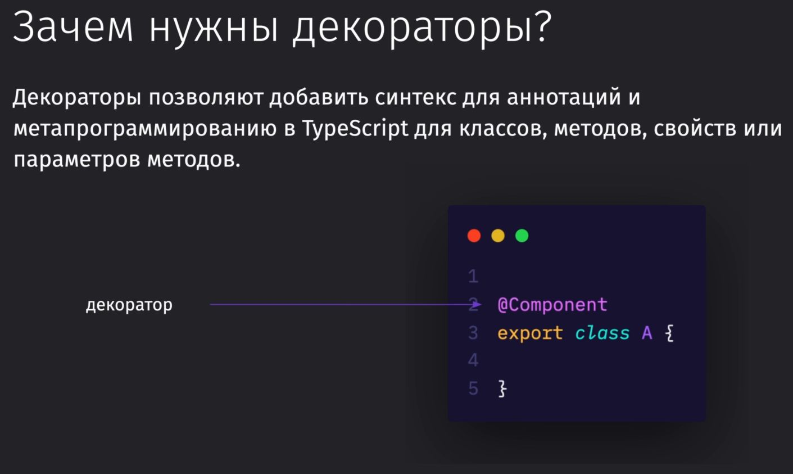
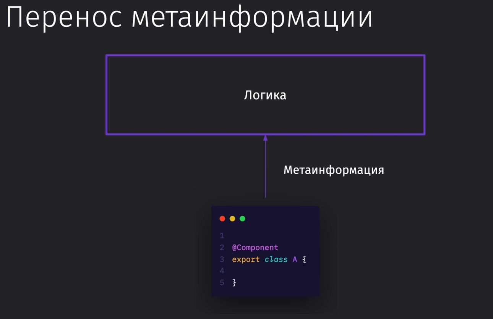
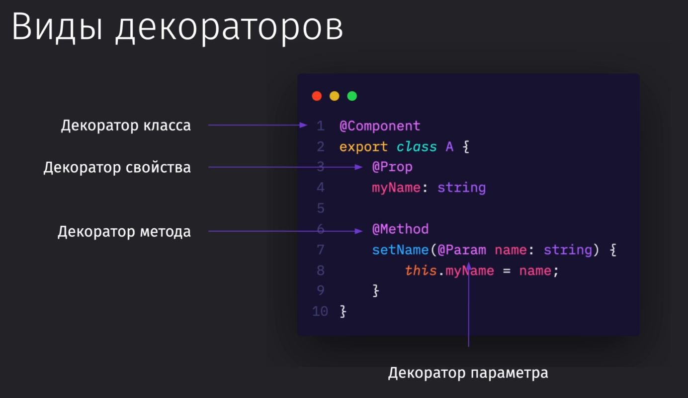
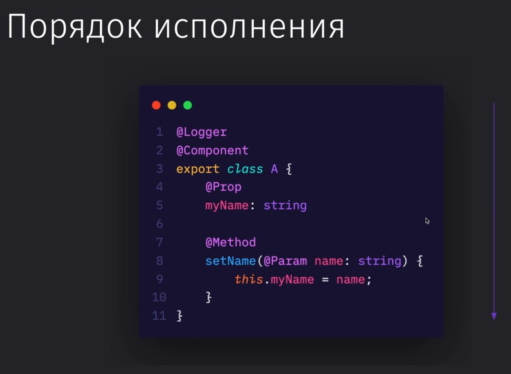
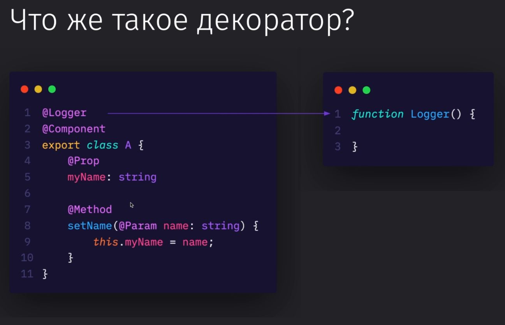
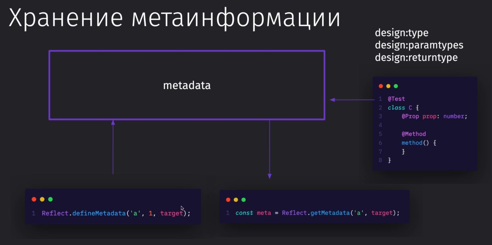

# berryies-api

- [basic server →](./basic/index.js)

- [express server →](./express/index.js)

- [routing →](./routing/index.js)

- [answers →](./answers/index.js)

- [modules & routes →](./modules-route/index.js)

- [middleware →](./middleware/index.js)

- [plusTs →](./plusTs/index.ts)

- [typeScript basic →](./plusTs/index.ts)
  - [type & interface →](./plusTs/ts-basic/test_type_interface.ts)
  - [literal →](./plusTs/ts-basic/test_literal.ts)
  - [enam →](./plusTs/ts-basic/test_enum.ts)
  - [generics →](./plusTs/ts-basic/test_generics.ts)
  - [classes→](./plusTs/ts-basic/test_classes.ts)
  - [other-stuff→](./plusTs/ts-basic/test_other.ts)

decorators

[Подробности →](./plusTs/ts-basic/test.ts)

metadata reflection

[Подробности →](./plusTs/ts-basic/test2.ts)

