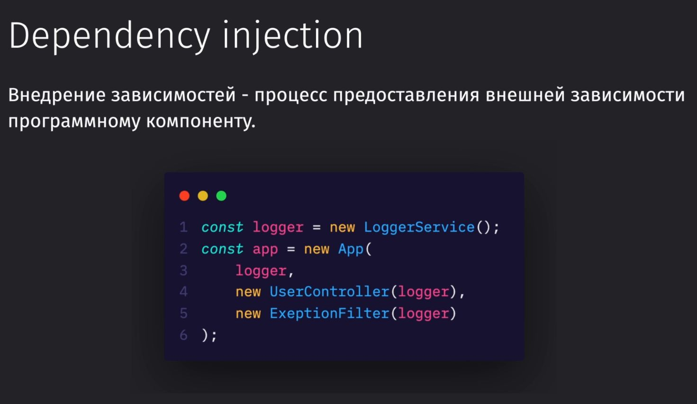
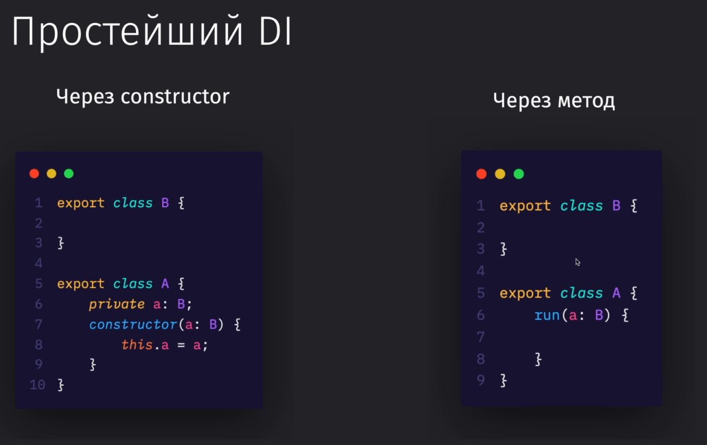
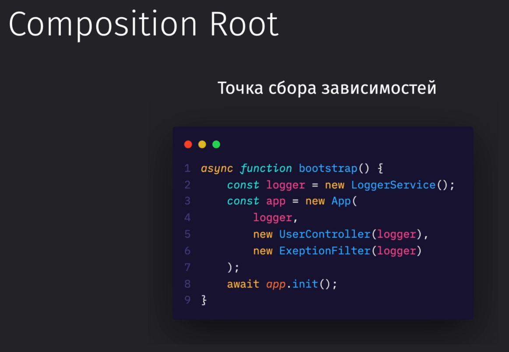
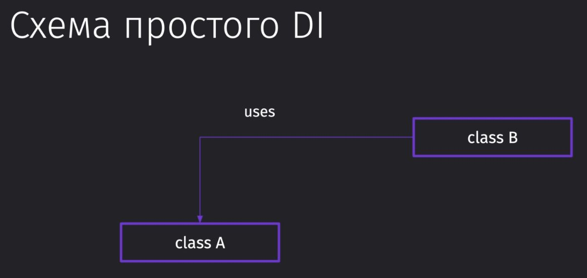
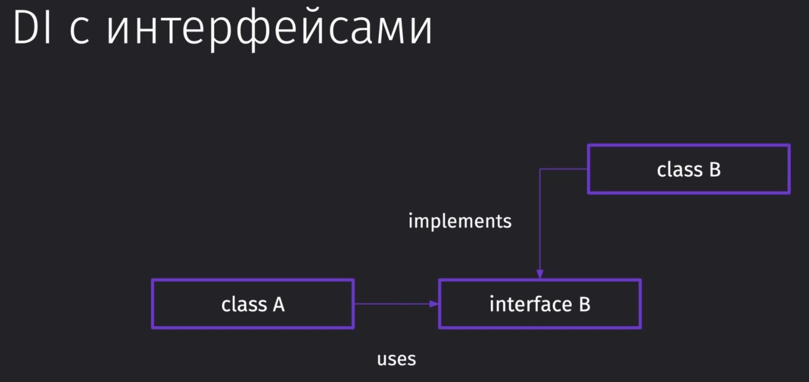
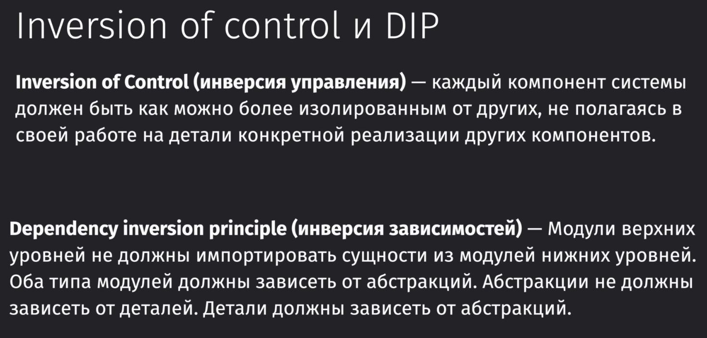
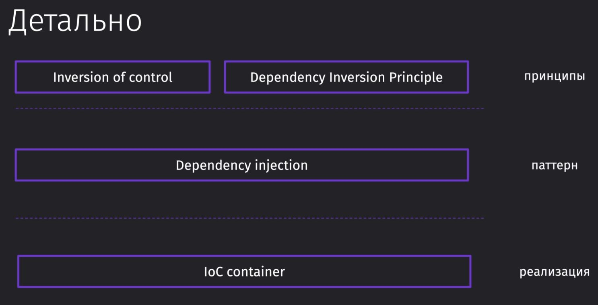
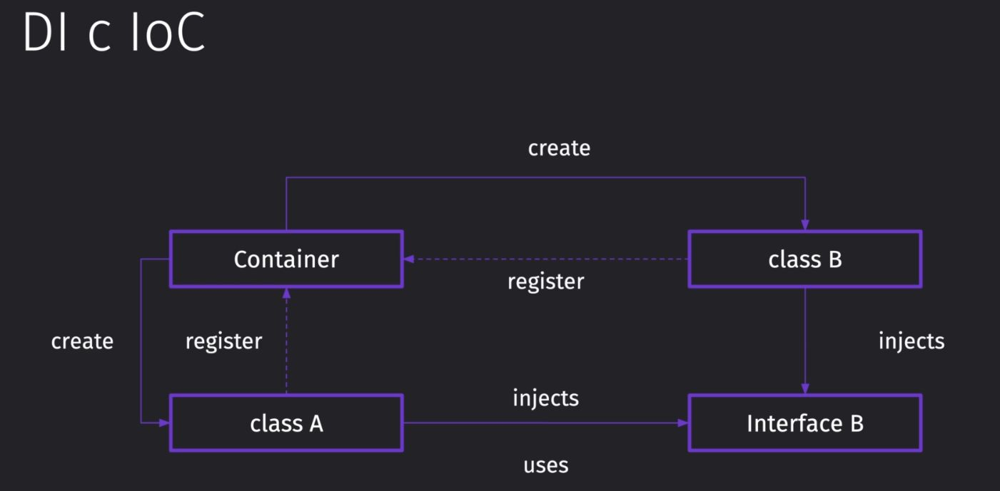
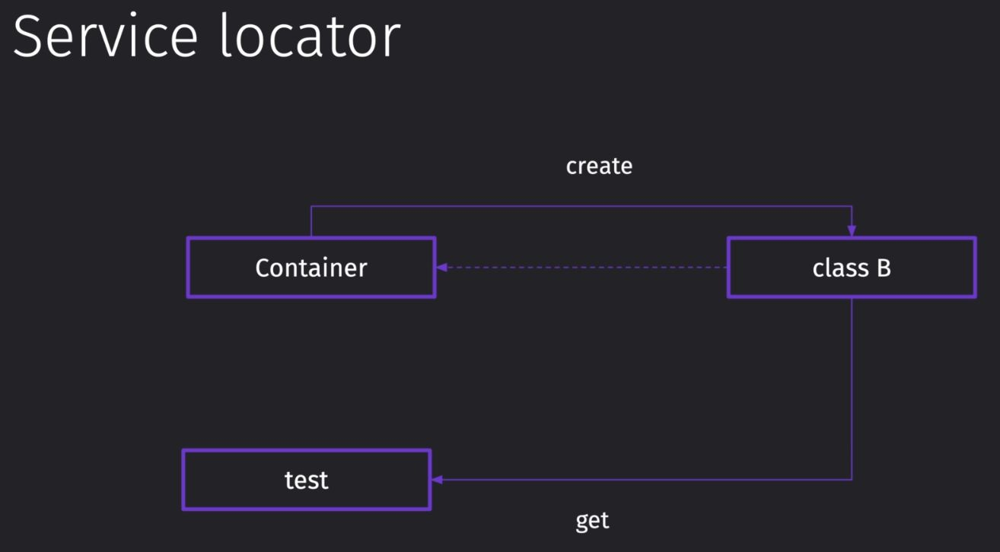

# flower-api

<details>
<summary>
init project
</summary>

create folder

```javascript
mkdir 10-flowers-api
```

move to folder

```javascript
cd 10-flowers-api
```

init package.json

```javascript
npm init
```

init ts config

```javascript
npm tsc --init
```

add typescript

```javascript
npm i typescript --save-dev
// or
npm i -g typescript
```

add ts express types

```javascript
npm i -D @types/express
```

</details>

<details>
<summary>
dep injection
</summary>



















</details>
